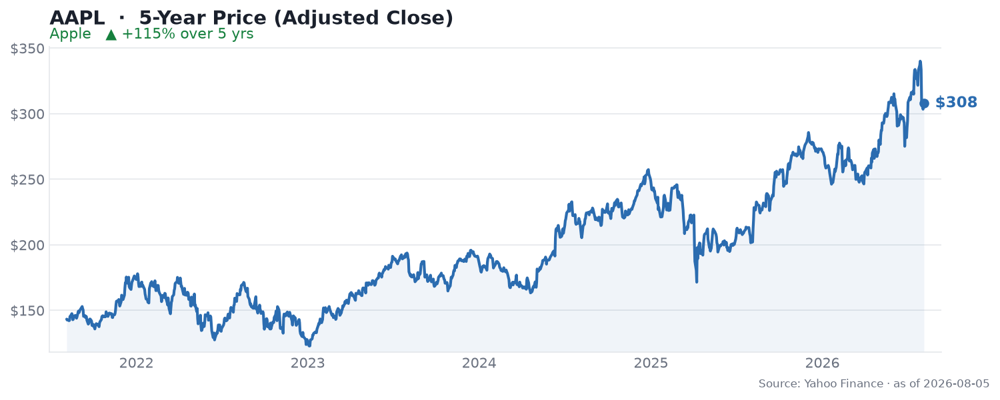

🌐 last30days v3.18.4 · synced 2026-07-29

What I learned:

**Apple walks into earnings at a record high and on the doorstep of $5 trillion** - The stock hit an all-time high around $334.68 in July, up roughly 20% year to date, briefly reclaiming the "world's most valuable company" crown from Nvidia, per [Seeking Alpha](https://seekingalpha.com/news/4614854-apple-upgraded-at-hsbc-as-firm-sees-strong-cycle-ahead). Fiscal Q3 2026 results land after the close on July 30, and the Street expects EPS around $1.89 (up ~20% YoY) on revenue near $109B (up ~16%), per [TipRanks](https://www.tipranks.com/news/apple-stock-price-forecast-what-financial-analysts-expect-ahead-of-q3-earnings). The whole month has been a pre-earnings run-up.

**HSBC's upgrade is the catalyst that flipped the narrative** - HSBC moved Apple from Hold to Buy and jacked its price target from $260 to $366 (~10% upside), calling Apple an "operational turning point," per [CNBC](https://www.cnbc.com/2026/07/17/apple-just-hit-a-record-high-hsbc-says-it-still-has-room-to-run.html). The [Schwab Network segment on YouTube](https://www.youtube.com/watch?v=Wn9cdse5o-s) relayed the core of the thesis: the bank "views Apple's hardware pipeline as really solid," including the iPhone 18 Pro lineup and an iPhone Air, plus a revamped Apple Intelligence leaning on its ~2.5 billion installed devices.

**Apple's pitch is the anti-hyperscaler trade, and the crowd loves it** - The most-repeated bull argument this month is that Apple spends only ~2.5% of sales on capex versus ~39% for the hyperscalers, so it sidesteps the capex-blowup debate crushing Alphabet, Meta, and Nvidia, per [Yahoo Finance](https://finance.yahoo.com/markets/stocks/articles/hsbc-says-apple-entering-powerful-143943856.html). Retail framed it more bluntly. On the thread about [Apple dethroning Nvidia](https://www.reddit.com/r/StockMarket/comments/1uz0mbw/apple_dethrones_nvidia_as_worlds_most_valuable/) (1,016 upvotes), [u/artbystorms](https://reddit.com/r/StockMarket/comments/1uz0mbw/comment/oy41uoa/) (141 upvotes) wrote: "Been saying for a year that Apple was smart to stay out of this AI slop race... Apple is looking very appealing as a much less 'AI in your face' option." [u/ng_logic](https://reddit.com/r/StockMarket/comments/1uz0mbw/comment/oy3wwnw/) (348 upvotes) put it as "the 'boring' mega-cap that doesn't even have a real AI story takes the crown back."

**The odds market is pricing a beat and a fresh high** - Polymarket has Apple beating quarterly earnings and clearing $344 in July at 87%, hitting $348 on the week at 72%, and its Q3 iPhone-revenue threshold at 92%, per the engine's market pull. That is an unusually confident setup going into a print - the risk is that a "priced for perfection" stock has little room to reward an in-line quarter.

**The quieter fundamental stories are about monetizing the base, not AI** - Two under-the-radar moves surfaced on Hacker News: [Apple is replacing the iPhone Upgrade Program with "Apple Upgrade"](https://www.apple.com/shop/iphone/iphone-upgrade-program) (182 points, 331 comments) and rolling out [Services price hikes for 2026](https://mjtsai.com/blog/2026/07/21/apple-services-price-hikes-2026/). Both point at the same lever - squeezing more recurring revenue out of the installed base - which is exactly the margin story HSBC is underwriting.

KEY PATTERNS from the research:
1. The bull thesis is capital-light AI - low capex, huge installed base, and Services/subscription monetization, per [Yahoo Finance](https://finance.yahoo.com/markets/stocks/articles/hsbc-says-apple-entering-powerful-143943856.html).
2. HSBC's Hold-to-Buy upgrade and $366 target reset sentiment and helped Apple retake the most-valuable-company crown, per [CNBC](https://www.cnbc.com/2026/07/17/apple-just-hit-a-record-high-hsbc-says-it-still-has-room-to-run.html).
3. Community sentiment leans "boring is beautiful" - investors like that Apple sat out the AI-capex arms race, per [r/StockMarket](https://reddit.com/r/StockMarket/comments/1uz0mbw/comment/oy41uoa/).
4. Prediction markets price a high-probability beat, which raises the bar for a positive July 30 reaction, per the Polymarket odds.
5. The real earnings tells are Services revenue and iPhone monetization moves (Apple Upgrade, price hikes), not an AI headline, per [Hacker News](https://www.apple.com/shop/iphone/iphone-upgrade-program).

---
✅ All agents reported back!
├─ 🟠 Reddit: 20 threads │ 6,728 upvotes │ 2,324 comments
├─ 🔴 YouTube: 5 videos │ 21,316 views │ 4/5 with transcripts
├─ 🟡 HN: 12 storys │ 621 points │ 594 comments
├─ 📊 Polymarket: 12 markets │ Apple (AAPL) hit (HIGH) $344 in July 87%, Apple (AAPL) hit (HIGH) $348 Week 72%, Apple (AAPL) Q3 iPhone revenue be: Apple (AAPL) Q3 iPhone revenue 92%
├─ 🗣️ Top voices: r/apple, r/stocks, r/FinnextAI
└─ 📎 Raw results saved to /home/user/scratch/reports/raw/apple-aapl-stock-raw-v3.md
---

---
I'm now an expert on Apple (AAPL) for the last 30 days. Some things you could ask:
- Is Apple's "capital-light AI" story enough to justify a near-$5T valuation?
- What does the market need to see in Services revenue on July 30 to keep the run going?
- Break down the HSBC bull case ($366) versus the ~$318-330 consensus target below the stock.

I have all the links to the 20 Reddit threads, 5 YouTube videos, 12 HN stories, and 12 Polymarket markets I pulled from. Just ask.

---

### 5-Year Price

▲ **+115% over 5 years** - adjusted close rose from $143.35 to $307.97. Source: Yahoo Finance (daily adjusted close, ~5 years through Aug 2026).

