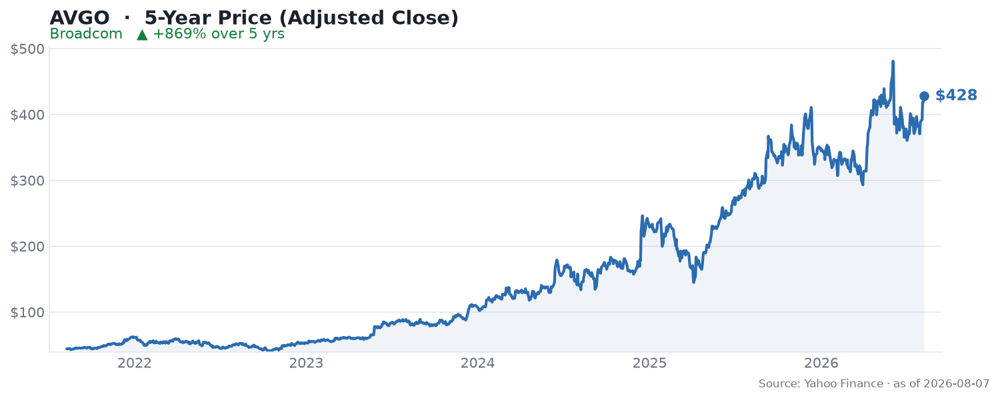

🌐 last30days v3.18.4 · synced 2026-08-08

What I learned:

**Broadcom is the "other" AI chip story - a near-monopoly in custom silicon, not GPUs** - The dominant framing this month is that while Nvidia owns merchant GPUs, Broadcom has quietly built a near-monopoly in custom AI ASICs (its "XPUs") for the hyperscalers - Google (TPU), Meta, ByteDance, Anthropic, and now OpenAI, per the [Wall Street Report breakdown on YouTube](https://www.youtube.com/watch?v=_nS1ypxwBiw). AI semiconductor revenue hit $10.8B in the latest quarter, up 143% year over year, and CEO Hock Tan has told investors that business tops $100B in 2027, per [The Motley Fool](https://www.fool.com/investing/2026/07/06/broadcom-is-24-off-its-high-and-just-unveiled-a-cu/).

**The OpenAI deal is the new leg of the story** - Broadcom and OpenAI unveiled a co-developed AI chip ("Jalapeño") in late June, part of a multiyear commitment to jointly engineer roughly 10 gigawatts of custom accelerators built exclusively for OpenAI, with first-generation volume deployment in 2027, per [The Motley Fool](https://www.fool.com/investing/2026/07/06/broadcom-is-24-off-its-high-and-just-unveiled-a-cu/). That lands on top of anchor commitments the community keeps citing - Meta's agreement running to 2029 and Alphabet's to 2031 - which is why bulls treat the revenue as unusually locked-in.

**The community's bull case is "sticky, contracted revenue"; the bear case is "it's just the AI trade"** - On the widely-shared [r/Stocks_Picks thread](https://www.reddit.com/r/Stocks_Picks/comments/1urfide/apple_locked_in_broadcom_through_2031_with_30b/) about Broadcom's long-dated customer lock-ins, [u/Popular-Jackfruit-60](https://reddit.com/r/Stocks_Picks/comments/1urfide/comment/owg8n8p/) argued the durability point: "RF front-end is hard to replace, so that revenue is sticky. Combined with 143% AI growth, the bear case feels a bit overcooked at this point." The counter was blunt macro skepticism from [u/pittige-pindasaus](https://reddit.com/r/Stocks_Picks/comments/1urfide/comment/owgcd6x/): "AI going in the shitter as we speak." And the long-term holders are unmoved - [u/Accomplished-Order43](https://reddit.com/r/Stocks_Picks/comments/1urfide/comment/owfh7d2/): "I've been in AVGO since 2013. No plan to sell any time soon."

**A supply-chain twist: Broadcom is diversifying its foundry beyond TSMC** - Reuters reported that [Samsung won a ~$200B Broadcom AI-chip partnership](https://www.reuters.com/business/autos-transportation/samsung-elec-wins-200-billion-broadcom-ai-chip-partnership-boosting-foundry-push-2026-07-25/), a boost to Samsung's foundry push and a notable second-source signal for Broadcom's XPU ramp. Prediction markets, meanwhile, are confident on the near term: Polymarket's "Will Broadcom Q3 AI revenue be above [threshold]?" sat at 88%.

**The soft spot is the same one it always is: VMware's heavy hand** - The recurring bear/reputational drag surfaced again on Hacker News, where [Allstate accused Broadcom of auditing it because it quit VMware](https://arstechnica.com/information-technology/2026/07/allstate-accuses-broadcom-of-auditing-it-because-it-quit-vmware-ca/). VMware is the cash engine (roughly $6.8B in quarterly revenue at ~78% margins that funds the XPU roadmap), but the aggressive post-acquisition licensing and audit tactics keep generating customer resentment. Broadcom's own August 6 rollout of new VMware vDefend and Avi Load Balancer features is the company trying to keep that base engaged. Note the stock context: AVGO is ~20-24% below its late-May all-time high, and Goldman Sachs removed it from its Conviction List in early August even as other analysts model large upside.

KEY PATTERNS from the research:
1. The thesis is custom AI ASIC dominance (XPUs) for hyperscalers, distinct from Nvidia's GPU franchise, per [Wall Street Report on YouTube](https://www.youtube.com/watch?v=_nS1ypxwBiw).
2. The OpenAI "Jalapeño" 10-gigawatt deal is the newest catalyst, adding to Meta (to 2029) and Alphabet (to 2031), per [The Motley Fool](https://www.fool.com/investing/2026/07/06/broadcom-is-24-off-its-high-and-just-unveiled-a-cu/).
3. Bulls emphasize contracted, sticky revenue and 143% AI growth; bears wave it off as the broader AI trade, per [r/Stocks_Picks](https://reddit.com/r/Stocks_Picks/comments/1urfide/comment/owg8n8p/).
4. Foundry diversification is underway - a reported ~$200B Samsung partnership second-sources the XPU ramp beyond TSMC, per [Reuters](https://www.reuters.com/business/autos-transportation/samsung-elec-wins-200-billion-broadcom-ai-chip-partnership-boosting-foundry-push-2026-07-25/).
5. VMware is both the funding engine and the reputational drag - high-margin cash flow, but licensing/audit aggression keeps generating customer friction, per [Hacker News](https://arstechnica.com/information-technology/2026/07/allstate-accuses-broadcom-of-auditing-it-because-it-quit-vmware-ca/).

---
✅ All agents reported back!
├─ 🟠 Reddit: 5 threads │ 797 upvotes │ 70 comments
├─ 🔴 YouTube: 1 video │ 14 views │ 1/1 with transcripts
├─ 🟡 HN: 13 storys │ 182 points │ 109 comments
├─ 📊 Polymarket: 1 market │ Broadcom (AVGO) Q3 AI revenue be: Broadcom (AVGO) Q3 AI revenue 88%
├─ 🗣️ Top voices: r/StockMarket, r/CassiaFinance, r/stocks
└─ 📎 Raw results saved to /home/user/scratch/reports/raw/broadcom-avgo-stock-raw-v3.md
---

---
I'm now an expert on Broadcom (AVGO) for the last 30 days. Some things you could ask:
- How locked-in is the XPU revenue really (Meta 2029, Alphabet 2031, OpenAI 2027)?
- Does the Samsung foundry deal meaningfully de-risk the TSMC dependence?
- Is the ~20% pullback from the May high a buying opportunity or the AI trade cooling?

I have all the links to the 5 Reddit threads, 1 YouTube video, 13 HN stories, and 1 Polymarket market I pulled from. Just ask.

---

### 5-Year Price

▲ **+869% over 5 years** - adjusted close rose from $44.12 to $427.76 (reflects the 2024 10-for-1 split). Source: Yahoo Finance (daily adjusted close, ~5 years through Aug 2026).

