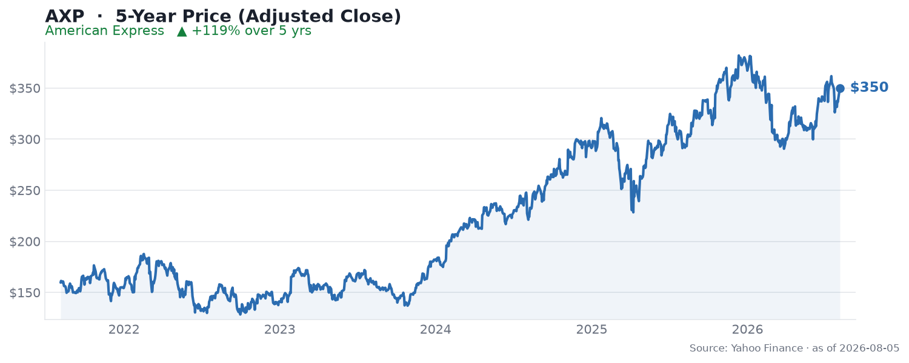

🌐 last30days v3.18.4 · synced 2026-08-03

What I learned:

**American Express beat on EPS, raised guidance, posted its best card spending in three years - and the stock fell** - AXP reported Q2 2026 on July 24 with EPS of $4.53 (up ~11% YoY, ahead of the ~$4.40-4.45 consensus) and 10% revenue growth, yet shares dropped ~2-4% afterward, per [Benzinga's earnings-call coverage](https://www.youtube.com/watch?v=csbMp72Clyg). The [r/stocks thread said it in the title](https://www.reddit.com/r/stocks/comments/1v76jk7/american_express_beat_earnings_raised_guidance/): "beat earnings, raised guidance and had its best card spending in 3 years, but the market reacted the other way."

**The tell was the top line: spending was strong, but it did not fully convert to revenue** - Revenue of $19.64B narrowly missed, and total network volumes of ~$516.8B came in under the Street's ~$520.9B. The most-cited community explanation, from [u/librariancap](https://reddit.com/r/stocks/comments/1v76jk7/comment/ozwhkcg/) (33 upvotes), was exactly that: the volumes miss "suggests the spending strength wasn't converting." The other top reaction was a macro worry - [u/ApeApplePine](https://reddit.com/r/stocks/comments/1v76jk7/comment/ozvus53/) (91 upvotes): "Not a good economic sign tbh." (The thread's single funniest note, a skeptical [u/Caradoc729](https://reddit.com/r/stocks/comments/1v76jk7/comment/ozw0gi1/) at 50 upvotes, just asked "Which LLM did you use to write this post?")

**The growth engine is the young, affluent cohort** - Card Member spending rose 9%, the fastest in three years, and total network volume jumped 15% as international travel blew past pre-pandemic levels, per the [Wall Street Report breakdown](https://www.youtube.com/watch?v=BHz6iCyt-p8). The standout stat: Gen Z spending up 38% and Millennials up 13%. Amex is deliberately courting these cohorts - management framed 2026 as the year to "make the upfront investments in the platinum value propositions," per the [earnings call](https://www.youtube.com/watch?v=csbMp72Clyg).

**Those premium perks are also the margin catch** - Amex raised full-year revenue growth guidance to 10% but explicitly held EPS guidance at $17.30-17.90, saying it plans to "reinvest this outperformance in growth initiatives," per the [call](https://www.youtube.com/watch?v=csbMp72Clyg). In other words, the revenue upside is being spent on acquiring younger members rather than dropping to the bottom line - an operating-expense acceleration that is a margin headwind, not a credit problem (write-offs remain low). It also authorized a $16B buyback, an unambiguous confidence signal.

**Valuation and the fintech threat are the debate** - At a blended P/E near 20.8x versus a historical norm around 16.8x, one [StockValues review](https://www.youtube.com/watch?v=kVs8noQowTQ) flagged AXP as potentially rich, and the sell-side sits Neutral-ish around a ~$385 median target amid rising expenses and competition. That competition question showed up in prediction markets too: Polymarket is running a ["Stripe vs American Express - higher valuation on December 31?"](https://polymarket.com/event/stripe-vs-american-express-higher-valuation-on-december-31) market - a neat encapsulation of the incumbent-versus-fintech framing hanging over the payments space.

KEY PATTERNS from the research:
1. A clean EPS beat and raised revenue guide still sold off - the market fixated on the revenue and network-volume miss, per [r/stocks](https://www.reddit.com/r/stocks/comments/1v76jk7/american_express_beat_earnings_raised_guidance/).
2. Card spending (+9%) was the best in three years and network volume rose 15% on booming international travel, per [Wall Street Report](https://www.youtube.com/watch?v=BHz6iCyt-p8).
3. The Gen Z (+38%) and Millennial (+13%) cohorts are the core growth story, per [Wall Street Report](https://www.youtube.com/watch?v=BHz6iCyt-p8).
4. Revenue guidance up to 10% but EPS held flat - upside is being reinvested into premium perks, an opex/margin headwind, per the [earnings call](https://www.youtube.com/watch?v=csbMp72Clyg).
5. Debate centers on a full-ish valuation (~20.8x vs ~16.8x norm) and the fintech threat, echoed in a Polymarket Stripe-vs-Amex market, per [StockValues](https://www.youtube.com/watch?v=kVs8noQowTQ).

---
✅ All agents reported back!
├─ 🟠 Reddit: 20 threads │ 9,691 upvotes │ 1,416 comments
├─ 🔴 YouTube: 4 videos │ 464 views │ 4/4 with transcripts
├─ 🟡 HN: 19 storys │ 1,189 points │ 960 comments
├─ 🗣️ Top voices: r/StockMarket, r/ValueInvesting, r/stocks
└─ 📎 Raw results saved to /home/user/scratch/reports/raw/american-express-axp-stock-raw-v3.md
---

---
I'm now an expert on American Express (AXP) for the last 30 days. Some things you could ask:
- Why did a beat-and-raise quarter sell off - is the network-volume miss a real warning?
- How durable is the Gen Z/Millennial spending surge given the premium-perk costs?
- Is ~20.8x earnings too rich, and how real is the Stripe/fintech threat?

I have all the links to the 20 Reddit threads, 4 YouTube videos, and 19 HN stories I pulled from. Just ask.

---

### 5-Year Price

▲ **+119% over 5 years** - adjusted close rose from $159.63 to $349.93. Source: Yahoo Finance (daily adjusted close, ~5 years through Aug 2026).

