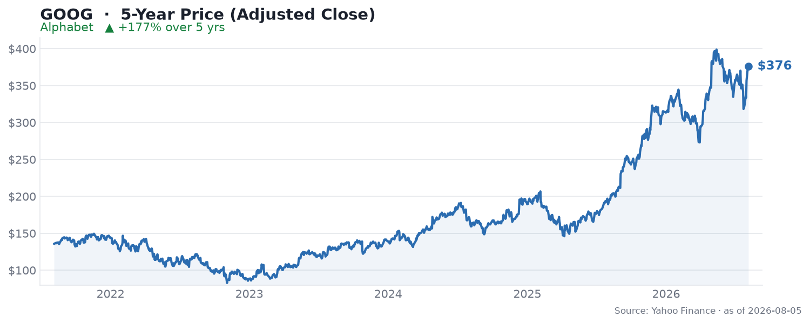

🌐 last30days v3.18.4 · synced 2026-07-29

What I learned:

**The best quarter in Alphabet's history got sold off anyway** - Alphabet reported Q2 2026 revenue of $119.8B (up 24% YoY) and GAAP EPS of $9.11 on July 22, beating the ~$116.9B the Street modeled, yet the stock fell roughly 5-6% in the days after, per [CNBC](https://www.cnbc.com/2026/07/22/google-earnings-q2-goog-live-updates.html). The r/CassiaFinance breakdown captured the whiplash in its title: ["Alphabet just had its best quarter in history - so why did the stock fall?"](https://www.reddit.com/r/CassiaFinance/comments/1v58a6z/alphabet_just_had_its_best_quarter_in_history_so/). The answer, in one word, is capex.

**The whole story is the capex hike, not the earnings beat** - Alphabet raised its 2026 capital-spending guidance to $195-205B (from $180-190B), and since the Street had modeled only ~$188B, the raise read as a warning rather than confidence, per [Value Add VC](https://valueaddvc.com/blog/alphabet-raises-2026-ai-capex-guidance-to-205-billion-what-changed). CFO Anat Ashkenazi framed it as "an acceleration in the delivery of capacity to meet growing demand," per [MLQ News](https://mlq.ai/news/alphabet-raises-2026-capex-guidance-to-195-205b-cloud-revenue-surges-82/). This is the same beat-then-drop pattern every hyperscaler printed this season, and it is why the [Magnificent Seven shed $787B in a single day](https://www.cnbc.com/2026/07/22/google-earnings-q2-goog-live-updates.html).

**Google Cloud is the number that should have won the day** - Cloud revenue surged 82% YoY to $24.8B with a backlog that crossed half a trillion dollars ($514B), and margins jumped from ~21% to ~35%, per the [UNRIVALED INVESTING breakdown on YouTube](https://www.youtube.com/watch?v=DofWanV_GzE). The bull case is that the capex the market hates is precisely what is filling that backlog. As [u/cinciNattyLight put it in r/ValueInvesting](https://reddit.com/r/ValueInvesting/comments/1v5j1et/comment/ozjfwuh/) (71 upvotes), "the capex is going into high margin, very high growth areas of these massive companies. They are competing with one another on market share."

**The community is split between "generational bargain" and "circular-financing bubble"** - The bullish camp finds the reaction absurd. One [top YouTube comment](https://www.youtube.com/watch?v=DofWanV_GzE) (@vidnovoc9815, 32 likes) marveled: "so 80 percent growth and a 514 billion dollar order backlog and the stock drops. what would this company have to do to actually go up? they own search, advertising, YouTube, waymo... cloud, 14 percent of anthropic." The skeptics point at balance-sheet engineering. [u/Happy-Marten in r/ValueInvesting](https://reddit.com/r/ValueInvesting/comments/1v5j1et/comment/ozjl1y3/) (37 upvotes) shot back: "SPVs, obscured leverage, circular capital and demand loops... what could go wrong?" That thread, seeded by [Moody's warning that "unprecedented" AI spending threatens the credit quality of Amazon, Meta, and Alphabet](https://www.reddit.com/r/ValueInvesting/comments/1v5j1et/moodys_says_unprecedented_ai_spending_threatens/), drew 202 points and 81 comments - the single most-engaged discussion in the window.

**Sell-side stays constructive; the odds market is genuinely torn** - Ahead of the print, Wedbush's Ygal Arounian named GOOGL a "top pick" and Stifel's Mark Kelley reiterated Buy with a $420 target (~19% upside), per [Finviz](https://finviz.com/news/113029/alphabet-googl-gets-190-price-target-ahead-of-earnings-analyst-sees-favorable-setup) and [TipRanks](https://www.tipranks.com/news/googl-stock-price-forecast-2026-what-financial-analysts-expect-ahead-of-q2-earnings). Prediction markets are less committed: Polymarket puts GOOGL hitting $340 at 57% and $380 at 54%, but the downside $280 marker at only 12%, which reads as "grind higher, limited crash risk."

KEY PATTERNS from the research:
1. Fundamentals are firing on every cylinder - 24% revenue growth, 82% cloud growth, $514B backlog, Gemini nearing 1B monthly active users - per [UNRIVALED INVESTING on YouTube](https://www.youtube.com/watch?v=DofWanV_GzE).
2. The market is trading capex, not earnings; a $195-205B spend guide against a ~$188B expectation is the entire selloff, per [Value Add VC](https://valueaddvc.com/blog/alphabet-raises-2026-ai-capex-guidance-to-205-billion-what-changed).
3. "Circular financing" and hidden-leverage fear is now the dominant bear thesis across mega-cap AI names, per [r/ValueInvesting](https://reddit.com/r/ValueInvesting/comments/1v5j1et/comment/ozjl1y3/).
4. The bull rebuttal is margin quality - the spend funds 35%-margin cloud capacity that is already sold (the backlog), per [r/ValueInvesting](https://reddit.com/r/ValueInvesting/comments/1v5j1et/comment/ozjfwuh/).
5. Retail investors read the drop as opportunity, not deterioration - the loudest sentiment is disbelief that a record quarter sold off, per [YouTube](https://www.youtube.com/watch?v=DofWanV_GzE).

---
✅ All agents reported back!
├─ 🟠 Reddit: 24 threads │ 19,881 upvotes │ 3,635 comments
├─ 🔴 YouTube: 9 videos │ 143,261 views │ 6/9 with transcripts
├─ 🟡 HN: 9 storys │ 56 points │ 7 comments
├─ 📊 Polymarket: 3 markets │ Alphabet Inc. (GOOGL) hit (LOW) $280 12%, Alphabet Inc. (GOOGL) hit (HIGH) $340 57%, Alphabet Inc. (GOOGL) hit (HIGH) $380 54%
├─ 🗣️ Top voices: r/Wiseek, r/stocks, r/StockMarket
└─ 📎 Raw results saved to /home/user/scratch/reports/raw/alphabet-goog-stock-raw-v3.md
---

---
I'm now an expert on Alphabet (GOOG) for the last 30 days. Some things you could ask:
- Is the $195-205B capex guide a red flag or the bull case in disguise?
- How does Google Cloud's $514B backlog compare with Azure and AWS this quarter?
- Break down the "circular financing" worry - is it real leverage or just narrative?

I have all the links to the 24 Reddit threads, 9 YouTube videos, 9 HN stories, and 3 Polymarket markets I pulled from. Just ask.

---

### 5-Year Price

▲ **+177% over 5 years** - adjusted close rose from $135.74 to $376.20. Source: Yahoo Finance (daily adjusted close, ~5 years through Aug 2026).

