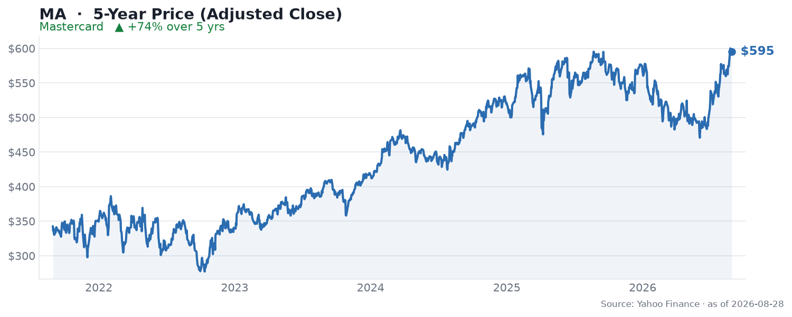

🌐 last30days v3.21.1 · synced 2026-08-30

What I learned:

**Mastercard is quietly compounding while the market watches AI** - Q2 2026 was a clean beat: adjusted EPS of **$5.04** topped consensus by ~5.7% and net revenue rose **14.1% to $9.3B**, per [Zacks via Yahoo Finance](https://finance.yahoo.com/markets/stocks/articles/mastercard-beats-q2-earnings-solid-162300467.html). The engine underneath was volume: gross dollar volume up 8%, **cross-border volume up 12%**, and switched transactions up 9%. Management guided Q3 net revenue growth to the high end of the low-double-digit range and pointed full-year performance toward the upper end of its existing range. No drama, no capex cliff - the opposite profile to most names in this directory.

**The strategic story is stablecoins and "agentic commerce"** - Mastercard is positioning for two structural shifts at once. On crypto rails, it completed its acquisition of stablecoin-infrastructure platform **BVNK** in early August and will enable **Open USD** - a neutral-market utility backed by a consortium of 140+ companies - on its network alongside USDC and USDG, per [TradingKey](https://www.tradingkey.com/analysis/stocks/us-stocks/262130139-mastercard-ma-q2-2026-9-3b-revenue-14-pct-bvnk-stablecoin-agentic-ai-tradingkey). On the AI side, the Q2 call leaned heavily on **agentic commerce** - payments initiated by AI agents - alongside security and new payment flows, per [Zacks](https://www.tradingview.com/news/zacks:9c90a1620094b:0-mastercard-q2-earnings-call-highlights-agentic-commerce-push/). Both are attempts to own the rails regardless of who or what initiates the transaction.

**The reliability risk is real, and it showed up this month** - The single item the engine surfaced from the tech community was a [global Mastercard outage that stopped shopping in Sydney](https://www.smh.com.au/national/global-mastercard-outage-stopping-shopping-in-sydney-20260815-p60omk.html) on August 15. For a business whose entire moat is "the network always works," outages are the one operational event that can dent the franchise narrative - worth noting even though it caused no visible damage to the stock.

**Valuation is the live debate, and Visa is the yardstick** - The sell side is enthusiastic: a **Strong Buy** consensus across 40 analysts with an average target near **$669** (roughly 12% above the ~$595 price), a $550-740 range, and Cantor Fitzgerald recently lifting its target to $695, per [StockAnalysis](https://stockanalysis.com/stocks/ma/forecast/) and [TipRanks](https://www.tipranks.com/news/the-fly/mastercard-price-target-raised-to-618-from-580-at-keefe-bruyette). The trade-off versus Visa is explicit: Mastercard trades at a slight premium (P/E ~31.1 vs ~29.8) but is modeled to grow adjusted EPS faster (~15.8% vs ~12.5% CAGR through 2028), while Visa remains the larger, wider-moat network with ~63% more volume and a ten-point operating-margin advantage, per [The Motley Fool](https://www.fool.com/investing/2026/04/24/visa-mastercard-widest-moats-financial-services/). You are paying up for growth in the smaller half of a duopoly.

**Community coverage was genuinely thin this window - and that itself is the signal** - Reddit surfaced 14 threads with meaningful aggregate engagement (4,113 upvotes, 1,382 comments across r/ValueInvesting, r/StockMarket, r/stocks and r/dividends), but the run was **rate-limited partway through** and no single Mastercard-specific discussion rose to the top of the ranking. That partial coverage means this is not evidence of silence - only that the free-source sweep could not complete. Still, the contrast with the AI names in this directory is stark: MA generates no viral threads, no prediction markets, and no controversy. It is the quiet-compounder profile, and its 5-year chart (+74%) reflects steady rather than spectacular.

KEY PATTERNS from the research:
1. A clean double-digit quarter - adjusted EPS $5.04 (beat ~5.7%), net revenue +14.1% to $9.3B, cross-border volume +12%, per [Yahoo Finance](https://finance.yahoo.com/markets/stocks/articles/mastercard-beats-q2-earnings-solid-162300467.html).
2. Two structural bets: stablecoin rails (BVNK acquisition, Open USD with 140+ firms) and agentic AI commerce, per [TradingKey](https://www.tradingkey.com/analysis/stocks/us-stocks/262130139-mastercard-ma-q2-2026-9-3b-revenue-14-pct-bvnk-stablecoin-agentic-ai-tradingkey).
3. Network reliability is the underrated risk - a global outage hit Sydney shoppers on August 15, per [The Sydney Morning Herald](https://www.smh.com.au/national/global-mastercard-outage-stopping-shopping-in-sydney-20260815-p60omk.html).
4. Sell side is bullish - 40-analyst Strong Buy, ~$669 average target (~12% upside), Cantor to $695, per [StockAnalysis](https://stockanalysis.com/stocks/ma/forecast/).
5. The Visa comparison frames the call - MA is the faster grower at a slight premium; Visa is the bigger, wider-moat network, per [The Motley Fool](https://www.fool.com/investing/2026/04/24/visa-mastercard-widest-moats-financial-services/).

---
✅ All agents reported back!
├─ 🟠 Reddit: 14 threads │ 4,113 upvotes │ 1,382 comments │ ⚠ partial after 14 items: HTTP 429: Too Many Requests (run doctor for fixes)
├─ 🟡 HN: 1 story │ 11 points │ 2 comments
├─ 🗣️ Top voices: r/ValueInvesting, r/StockMarket, r/stocks
└─ 📎 Raw results saved to /home/user/scratch/reports/raw/mastercard-ma-stock-raw-v3.md
---

---
I'm now an expert on Mastercard (MA) for the last 30 days. Some things you could ask:
- Is paying a premium to Visa justified by the faster EPS growth?
- How real is the agentic-commerce opportunity versus marketing framing?
- Do stablecoin rails (Open USD, BVNK) defend the network or cannibalize interchange?

I have all the links to the 14 Reddit threads and 1 HN story I pulled from. Just ask - note Reddit was rate-limited mid-run, so community coverage here is partial.

---

### 5-Year Price

▲ **+74% over 5 years** - adjusted close rose from $342.76 to $595.30. Source: Yahoo Finance (daily adjusted close, ~5 years through Aug 2026).

