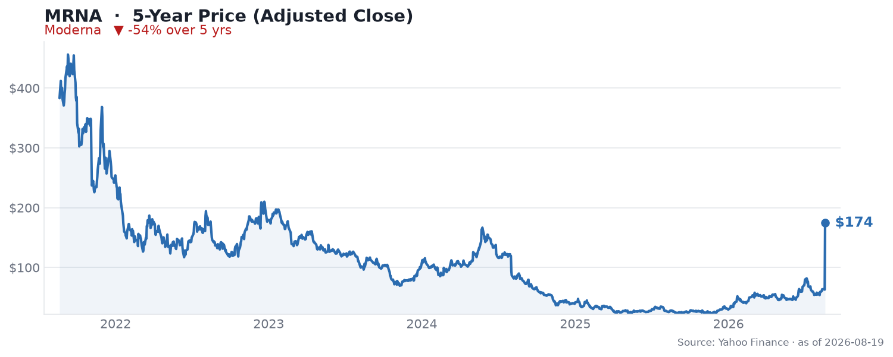

🌐 last30days v3.18.4 · synced 2026-08-20

What I learned:

**Moderna just had the single biggest day in this entire report set - the stock roughly doubled on cancer-vaccine data** - On August 19 Merck and Moderna announced that the Phase 3 [INTerpath-001 trial of intismeran autogene plus KEYTRUDA met its primary endpoint of recurrence-free survival and its key secondary endpoint of distant metastasis-free survival](https://news.modernatx.com/merck-and-moderna-announce-phase-3-interpath-001-trial-of-intismeran-plus-keytruda-met-endpoints-of-rfs-and-dmfs-in-melanoma) in completely resected stage IIB-IV melanoma. Shares gapped up ~60% premarket and [closed the day up roughly 177%](https://www.reddit.com/r/stockrager/comments/1vt3p7n/moderna_stock_doubles_as_firstever_mrna_cancer/). The r/wallstreetbets thread drew 4,206 upvotes and the play-by-play in the comments captures the disbelief in real time - [u/atape_1](https://reddit.com/r/wallstreetbets/comments/1vsjjj7/comment/p4lkbx9/) (1,384 upvotes): "60% up on the premarket, wild," and [u/Sooperooser](https://reddit.com/r/wallstreetbets/comments/1vsjjj7/comment/p4losux/) (556 upvotes) simply edited his own comment upward: "*92% Edit: 108% now."

**Why it matters scientifically, not just to the tape** - This is the first positive Phase 3 readout for an individualized neoantigen therapy and for any mRNA-based cancer therapy, per [BioPharm International](https://www.biopharminternational.com/view/merck-moderna-intismeran-autogene-pembrolizumab-phase-3-melanoma). The trial randomized 1,137 patients 2:1 to intismeran plus KEYTRUDA versus KEYTRUDA alone, and it follows five-year Phase 2b KEYNOTE-942 data at ASCO 2026 showing a 49% reduction in risk of recurrence or death. The biotech crowd focused on the trial mechanics rather than the price action - [u/MRC1986 in r/biotech](https://www.reddit.com/r/biotech/comments/1vskmez/merck_modernas_personalized_cancer_vaccine_slows/) (37 upvotes) noted that "to end the trial early at an interim analysis shows how much better this approach worked vs pembro. Probably has really great data on RFS. Really remarkable outcome." The plain-language version, from [u/PortfolioTrackr](https://reddit.com/r/stocks/comments/1vsje9n/comment/p4lmow6/) (456 upvotes): "taking a piece of a patient's tumor, mapping its genes and printing a custom mRNA shot to train the body to hunt down remaining cancer cells sounds like sci-fi, but it actually worked."

**Even after doubling, this is still a deeply broken chart - and holders know it** - The best-upvoted comment of the whole window is a punchline about scale, from [u/luv2block](https://reddit.com/r/stocks/comments/1vsje9n/comment/p4ll46h/) (534 upvotes): "Now it's only down 84% on the 5yr." Post-surge, MRNA is around $174, still **down ~55% over five years and ~62% below its September 2021 peak**. Long-suffering holders were vindicated rather than enriched - [u/BadHombreSinNombre](https://www.reddit.com/r/biotech/comments/1vsl761/moderna_shares_jump_nearly_100_on_skin_cancer_trial_success/) (69 upvotes): "This is what I've been waiting for hodling Moderna for 5 years." And [u/rjanderson8](https://reddit.com/r/biotech/comments/1vsl761/moderna_shares_jump_nearly_100_on_skin_cancer_trial_success/) (164 upvotes) caught the irony: "Particularly funny after the post yesterday complaining about the lackluster stock performance."

**The financials underneath are still a cash-runway story, not a growth story** - Q2 2026 revenue was just $145M (up 2% YoY) against a net loss of $782M ($1.97 per share), per [GuruFocus/Investing.com](https://ca.investing.com/news/company-news/moderna-inc-mrna-q2-2026-earnings-call-highlights-revenue-beat-and-pipeline-progress-amid--4769131). Management is playing defense well: cash costs down 10% YoY, full-year cash-cost guidance cut to ~$4B, a $6.9B cash position, and projected year-end cash of $4.7-5.2B. That combination - a sub-$150M quarterly top line, a ~$780M quarterly loss, and multi-year cash - is precisely why a single pipeline readout can move the equity 100%+: the value here is almost entirely in the pipeline, not in current earnings.

**The second, quieter catalyst was a real product approval** - The FDA approved [mFLUSIVA, Moderna's flu vaccine for adults 50+](https://www.reddit.com/r/biotech/comments/1vh3y78/moderna_receives_us_fda_approval_for_influenza/) on August 6, its fifth global product, with a US launch targeted at the 2026-27 season. Notably, the biotech community was skeptical rather than celebratory - [u/gumercindo1959](https://reddit.com/r/biotech/comments/1vh3y78/comment/p220hlu/) (39 upvotes) flagged the competitive problem: "Interesting entry into the flu market given sanofi's dominance. Wonder what this means for the combo vaccines." Balance that against a genuine setback in the window: the Phase 3 norovirus program added a cohort after an interim analysis missed early success criteria.

KEY PATTERNS from the research:
1. The Phase 3 melanoma readout is the entire story - a ~177% single-day move on the first-ever positive Phase 3 for an mRNA cancer therapy, per [Moderna](https://news.modernatx.com/merck-and-moderna-announce-phase-3-interpath-001-trial-of-intismeran-plus-keytruda-met-endpoints-of-rfs-and-dmfs-in-melanoma).
2. Scientific credibility, not just hype - RFS and DMFS both met in 1,137 patients, on top of a 49% recurrence-risk reduction in the Phase 2b five-year data, per [BioPharm International](https://www.biopharminternational.com/view/merck-moderna-intismeran-autogene-pembrolizumab-phase-3-melanoma).
3. Scale check - even after doubling, the stock is down ~55% over five years and ~62% off its 2021 peak, per [r/stocks](https://reddit.com/r/stocks/comments/1vsje9n/comment/p4ll46h/).
4. The fundamentals are a cash-runway story - $145M quarterly revenue against a $782M loss, offset by ~$6.9B cash and disciplined cost cuts, per [GuruFocus](https://ca.investing.com/news/company-news/moderna-inc-mrna-q2-2026-earnings-call-highlights-revenue-beat-and-pipeline-progress-amid--4769131).
5. Mixed pipeline elsewhere - mFLUSIVA flu approval (into Sanofi's dominant market) alongside a norovirus interim miss, per [r/biotech](https://www.reddit.com/r/biotech/comments/1vh3y78/moderna_receives_us_fda_approval_for_influenza/).

---
✅ All agents reported back!
├─ 🟠 Reddit: 21 threads │ 20,090 upvotes │ 2,353 comments
├─ 🟡 HN: 9 storys │ 613 points │ 258 comments
├─ 🗣️ Top voices: r/wallstreetbets, r/biotech, r/stocks
└─ 📎 Raw results saved to /home/user/scratch/reports/raw/moderna-mrna-stock-raw-v3.md
---

---
I'm now an expert on Moderna (MRNA) for the last 30 days. Some things you could ask:
- How big is the commercial opportunity for intismeran autogene if it reaches approval?
- Does ~$6.9B in cash plus ~$4B annual cash costs buy enough runway to reach oncology revenue?
- Can mFLUSIVA take meaningful flu share from Sanofi, or is it a pandemic-preparedness product?

I have all the links to the 21 Reddit threads and 9 HN stories I pulled from. Just ask.

---

### 5-Year Price

▼ **-55% over 5 years** - adjusted close fell from $382.98 to $174.38, and remains ~62% below its September 2021 peak of $455.92, even after the ~177% single-day surge on August 19, 2026. Source: Yahoo Finance (daily adjusted close, ~5 years through Aug 2026).

