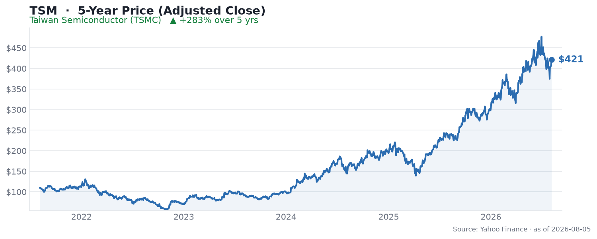

🌐 last30days v3.18.4 · synced 2026-07-29

What I learned:

**TSMC posted a blowout quarter and the stock still slipped** - Taiwan Semiconductor reported Q2 2026 on July 16-17 with revenue of $40.2B (up ~34% YoY) and net income of NT$706.6B (~$22.4B, up ~78% YoY), beating the ~NT$623.7B consensus, per [Bloomberg Television on YouTube](https://www.youtube.com/watch?v=6xS3bMEsSE4). Q3 revenue guidance of $44.6-45.8B implies roughly 36% growth. Yet as [r/iOCharts summed up](https://www.reddit.com/r/iOCharts/comments/1v1b5tt/tsmc_just_committed_265_billion_to_arizona_net/), "the stock is still down 7% from results day" - the same beat-and-fade the whole AI-chip complex printed this month.

**AI is now the engine, and TSMC is leaning into US capacity hard** - AI accelerators drive around a third of TSMC's revenue, per [The Next Platform](https://www.nextplatform.com/ai/2026/07/16/ai-chips-drive-around-a-third-of-tsmc-revenues/5273929), and the company is [accelerating its Arizona build-out to capitalize on the AI "megatrend"](https://www.cnbc.com/2026/07/20/tsmc-arizona-fab-capacity-ai-chip-demand.html) with a [further ~$100B of US investment](https://asia.nikkei.com/business/tech/semiconductors/tsmc-plans-further-100bn-us-investment-to-feed-ai-demand), taking its total Arizona commitment toward ~$265B by community math. 2nm wafers reportedly started shipping around $30,000 each, and Nikkei reported TSMC will [raise prices up to 10% in 2027](https://www.reddit.com/r/SNDK_Stock/comments/1v2czmm/tsm_to_raise_prices_what_does_this_mean_for_sndk/) - pricing power that only a monopoly foundry has.

**The community's read: this is sentiment, not fundamentals** - The most-upvoted reaction to the earnings thread was pure gallows humor about the sector - [u/Athenushoros](https://reddit.com/r/stocks/comments/1uxuhqi/comment/oxu4hr1/) (288 upvotes): "I'm sure this will lead to a huge dump in semis tomorrow," and [u/Gandalftron](https://reddit.com/r/stocks/comments/1uxuhqi/comment/oxu7n27/) (66) added, "As is tradition." On the sector-wide sell-off thread, [u/No-Plenty3727](https://reddit.com/r/stocks/comments/1v1x348/comment/oyqu0cs/) (107) argued the obvious: "semiconductor stocks are now driven primarily by sentiment; greed and fear, rather than fundamentals."

**Underneath the noise, the long-term bull case is "the moat is real"** - Even amid the wobble, the durable-franchise view held up. [u/MrGunny94](https://reddit.com/r/stocks/comments/1v1x348/comment/oyr0x6r/) (39 upvotes) put it plainly: "TSM is a great play long term, the moat is real." That is the sell-side view too: BofA raised its target to $590 (from $490), Needham to $530, and the average target near $520 implies roughly 17% upside, per [TipRanks](https://www.tipranks.com/news/tsmc-stock-price-forecast-top-analysts-raise-targets-ahead-of-q2-earnings) and [Yahoo Finance](https://finance.yahoo.com/technology/ai/articles/citi-raises-tsmc-price-target-105530371.html).

**The risk is that TSMC has become the whole trade's tell** - Because it makes the chips for Nvidia, Apple, and every hyperscaler ASIC, TSMC's report is treated as the read-through for the entire AI hardware chain - [r/CassiaFinance framed it as "Riding the AI Boom, Facing the Wobble"](https://www.reddit.com/r/CassiaFinance/comments/1v8thys/chip_stocks_riding_the_ai_boom_facing_the_wobble/), noting the record profit jump collided with stretched sector valuations. When TSMC trades on sentiment rather than its own record numbers, it is a sign the market is de-risking the AI trade broadly, not doubting TSMC specifically.

KEY PATTERNS from the research:
1. Record fundamentals (revenue +34%, net income +78%, Q3 guide +36%) met a ~7% post-earnings drop - a beat-and-fade, per [r/iOCharts](https://www.reddit.com/r/iOCharts/comments/1v1b5tt/tsmc_just_committed_265_billion_to_arizona_net/).
2. AI accelerators are ~a third of revenue and the primary growth driver, per [The Next Platform](https://www.nextplatform.com/ai/2026/07/16/ai-chips-drive-around-a-third-of-tsmc-revenues/5273929).
3. Aggressive US capacity expansion (~$100B more into Arizona) plus 2027 price hikes signal confidence and pricing power, per [CNBC](https://www.cnbc.com/2026/07/20/tsmc-arizona-fab-capacity-ai-chip-demand.html).
4. Retail sees the move as sector sentiment, not company-specific deterioration, per [r/stocks](https://reddit.com/r/stocks/comments/1v1x348/comment/oyqu0cs/).
5. Sell-side stays firmly bullish - BofA $590, Needham $530, ~$520 average (~17% upside), per [TipRanks](https://www.tipranks.com/news/tsmc-stock-price-forecast-top-analysts-raise-targets-ahead-of-q2-earnings).

---
✅ All agents reported back!
├─ 🟠 Reddit: 11 threads │ 1,064 upvotes │ 358 comments
├─ 🔴 YouTube: 5 videos │ 32,986 views │ 0/5 with transcripts
├─ 🟡 HN: 8 storys │ 62 points │ 6 comments
├─ 🗣️ Top voices: r/stocks, r/CassiaFinance, r/investing
└─ 📎 Raw results saved to /home/user/scratch/reports/raw/tsmc-tsm-stock-raw-v3.md
---

---
I'm now an expert on TSMC (TSM) for the last 30 days. Some things you could ask:
- Why does a record quarter (+78% net income) still sell off ~7%?
- How big is the AI-accelerator mix really, and where is it heading?
- What do the Arizona expansion and 2027 price hikes signal about pricing power?

I have all the links to the 11 Reddit threads, 5 YouTube videos, and 8 HN stories I pulled from. Just ask.

---

### 5-Year Price

▲ **+283% over 5 years** - adjusted close rose from $109.90 to $421.39. Source: Yahoo Finance (daily adjusted close, ~5 years through Aug 2026).

