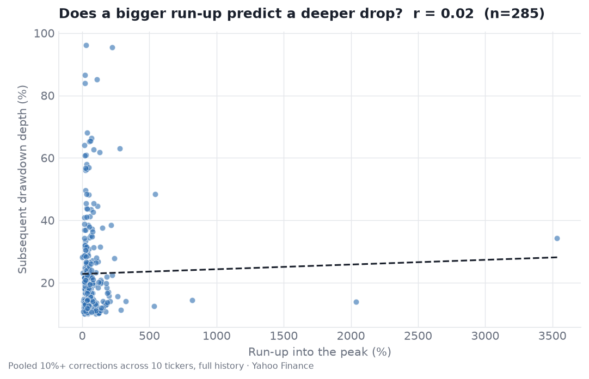
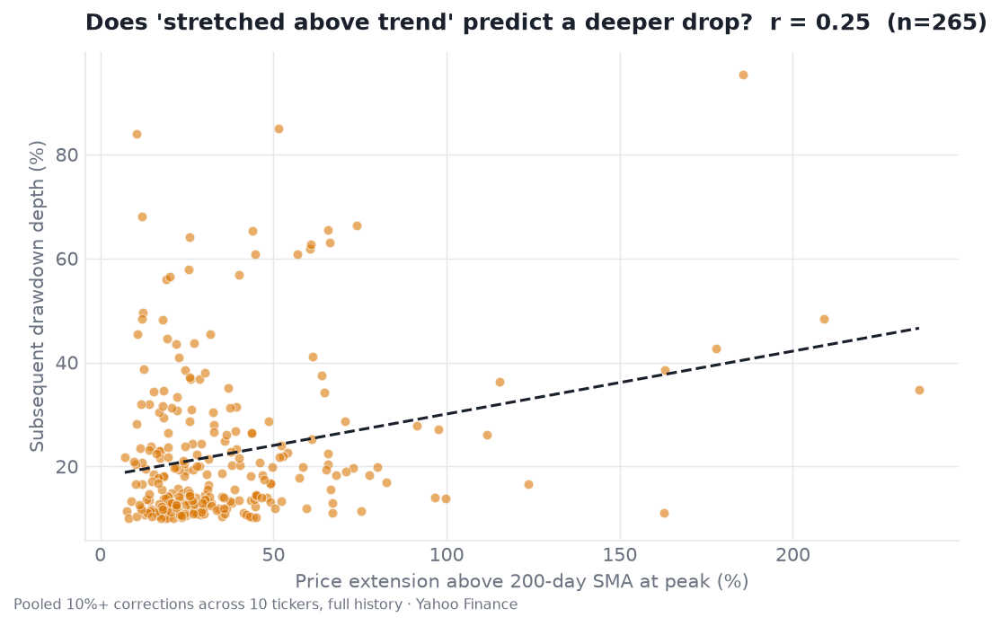
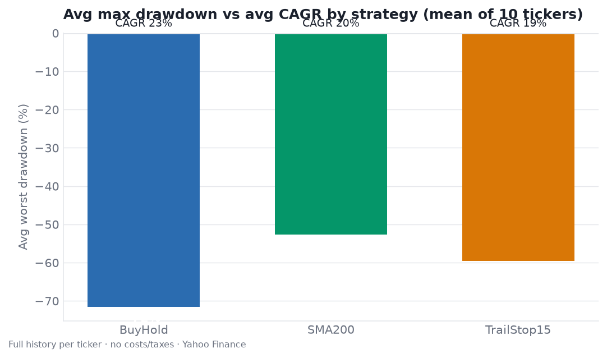
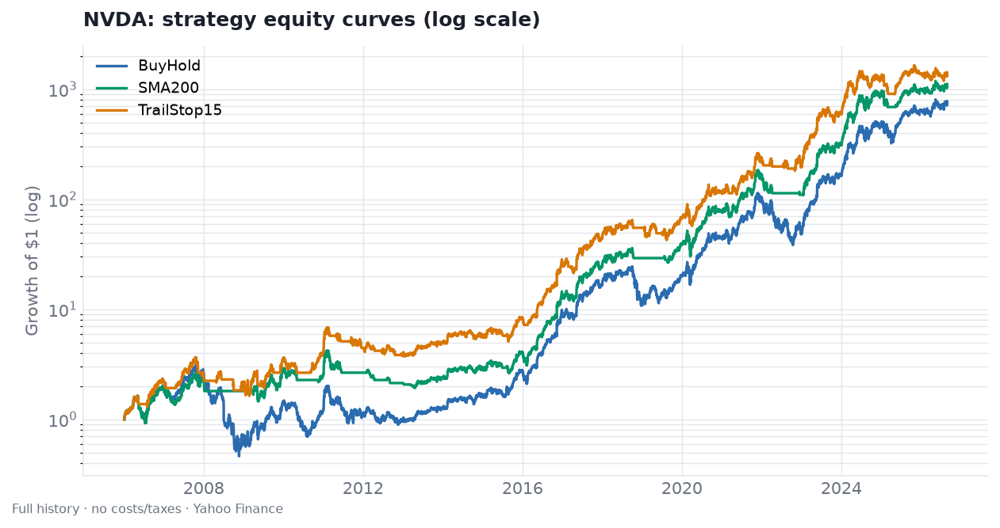
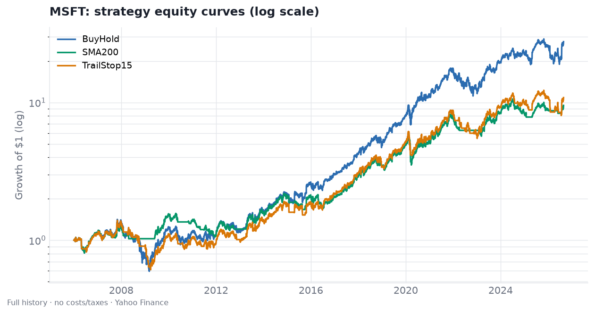

# Can Corrections Be Predicted? A Backtest

An empirical test of the intuition that these stocks "grow, then correct back to a past level." Two questions, tested on **~20 years of real daily data** (2006-01 to 2026-08, Yahoo Finance) for the **13 charted tickers**, plus **three rules-based strategies** backtested against buy-and-hold.

> **Read this first.** These are hand-picked large caps (mostly big winners), tested **in-sample** on a **single historical path**, with **no transaction costs, taxes, or slippage**, and cash assumed to earn **0%**. That combination flatters nothing and proves nothing out-of-sample. Treat this as exploratory data analysis, **not** a validated trading system and **not** investment advice. `RVII` is excluded (no price history). `AVGO` history starts at its 2009 IPO, `MA` at its 2006 IPO, `MRNA` at its 2018 IPO. MRNA is the one big decliner in the set - a useful counterweight to the winners-only selection bias.

## TL;DR

1. **The *timing* of corrections is essentially unpredictable.** Gaps between corrections are close to memoryless (lag-1 autocorrelation ≈ **-0.03** pooled; per-ticker all between -0.27 and +0.16) and highly irregular (coefficient of variation 0.7-2.2). Knowing when the last drop happened tells you almost nothing about when the next one comes.
2. **The *depth* of a drop is barely predictable.** The single most intuitive predictor - how far the stock ran up into the peak - has **r = 0.02** (none). The best hints are "how stretched above the 200-day trend" (**r = 0.25, t 4.2**) and recent volatility (**r = 0.16**) - both strengthened by adding MRNA, whose stretched 2021 peak preceded a 95% collapse. A 4-feature regression still explains only **~8%** of the variance in drop depth. Your best estimate of the next drop is just the stock's own historical median (roughly **13-28%**), and the spread around it is enormous.
3. **One relationship *is* strong - but it's mechanical.** Deeper corrections are followed by longer gaps to the next peak (**r = 0.72**). That's mostly recovery-time arithmetic (a deep hole takes longer to climb out of), not foresight about the next top.
4. **The strategies cut drawdowns but usually cost return.** A 200-day trend filter shrank the average worst drawdown from **-72%** to **-53%** (lower drawdown in 11/13 names) but beat buy-and-hold on total return in only **3/13**. Risk-adjusted (Sharpe) it was roughly a wash. Crash-avoidance paid off outright only where crashes were deepest (MRNA, AMD, NVDA) - and on MRNA it nearly doubled the CAGR.

## Method

- **Data:** daily adjusted close, 2006-01-03 to 2026-08-28 (~5,196 trading days per ticker; MA from its May-2006 IPO, AVGO from its Aug-2009 IPO, MRNA from its Dec-2018 IPO), Yahoo Finance v8 chart API via the agent proxy. Adjusted close folds in splits/dividends.
- **Correction (drawdown episode):** track the running peak; an episode runs peak → trough → recovery to a new high. Keep episodes whose peak-to-trough decline is **≥ 10%** (a secondary ≥ 20% table is also saved). This is the standard drawdown-episode definition; smaller wobbles inside one underwater stretch merge into the larger episode.
- **"Delta between corrections":** peak-to-peak spacing, in trading days.
- **Predictors (measured at the peak, using only prior data - no look-ahead):** run-up from the previous trough, days since the last peak, trailing 60-day annualized volatility, and % extension above the 200-day SMA.
- **Strategies (signals use only lagged data):**
  - **Buy & Hold** - benchmark.
  - **SMA-200 trend filter** - invested only while yesterday's close is above the 200-day SMA, else in cash (0%).
  - **Trailing-stop 15%** - exit when price falls 15% from its in-position high; re-enter when it closes back above the 50-day SMA ("sell the correction").
- **Metrics:** CAGR, annualized volatility, Sharpe (rf = 0), max drawdown, % time invested, number of round-trip entries.

Full code: [`backtest.py`](backtest.py). Raw outputs: [`data/`](data/) (`corrections_10pct.csv`, `corrections_20pct.csv`, `predictability.json`, `strategy_metrics.csv`, `strategy_aggregate.json`).

## Q1 - Is the time *between* corrections predictable?

No. Intervals are irregular and show no memory.

| Ticker | 10%+ corrections | Median depth | Max depth | Median gap (trading days) | Gap variability (CV) | Gap autocorr (lag-1) |
|--------|-----------------:|-------------:|----------:|--------------------------:|---------------------:|---------------------:|
| GOOG | 19 | 19.5% | 65.3% | 196 (~9 mo) | 0.94 | -0.13 |
| AAPL | 32 | 14.1% | 60.9% | 118 (~5.5 mo) | 0.96 | -0.23 |
| NVDA | 27 | 18.3% | 85.1% | 71 (~3.5 mo) | 2.24 | -0.03 |
| MSFT | 19 | 14.1% | 57.9% | 184 (~9 mo) | 1.10 | -0.22 |
| TSM | 32 | 18.4% | 56.5% | 144 (~7 mo) | 0.69 | -0.08 |
| ASML | 35 | 14.5% | 64.1% | 82 (~4 mo) | 1.10 | -0.21 |
| MRVL | 9 | 26.4% | 86.5% | 142 (~7 mo) | 1.81 | -0.27 |
| AMD | 11 | 26.1% | 96.2% | 130 (~6 mo) | 1.99 | -0.07 |
| JPM | 17 | 13.3% | 68.1% | 189 (~9 mo) | 1.15 | -0.13 |
| AXP | 15 | 19.8% | 83.9% | 153 (~7 mo) | 1.00 | -0.01 |
| AVGO | 32 | 14.3% | 48.3% | 92 (~4.4 mo) | 0.88 | +0.16 |
| **MRNA** | 14 | **28.4%** | **95.4%** | **41 (~2 mo)** | 1.00 | -0.25 |
| MA | 23 | 16.7% | 62.7% | 124 (~6 mo) | 0.93 | -0.17 |

A lag-1 autocorrelation near zero (and pooled **-0.03**, n=260) means "the last gap was long/short" carries essentially no information about the next gap. The pooled test of "does the prior run-up predict time to the next correction" is also null (r = -0.05). The two extremes bracket the set: **AVGO** has the shallowest max drawdown (-48%), the closest thing to a "smooth" compounder, while **MRNA** is the most violent - the deepest median correction (28.4%), a 95.4% max drawdown, and corrections arriving roughly every 2 months (median 41 trading days, less than a third of the group median). Its gaps are still irregular and memoryless like everyone else's.

## Q2 - Is the *size* of the drop predictable?

Weakly - but better than before. Pooled across all 285 corrections:

| Predictor of drop depth | Pearson r | n | Verdict |
|-------------------------|----------:|---:|---------|
| Run-up into the peak | **+0.02** | 285 | none |
| % extension above 200-day SMA | **+0.25** | 265 | weak-moderate (t 4.2) |
| Trailing 60-day volatility | +0.16 | 274 | weak (t 2.7) |
| Days since last correction | -0.07 | 272 | none |
| **All four (multiple regression R²)** | **0.084** | 264 | ~8% explained |

The most seductive idea - "the more it ran up, the harder it falls" - is still simply not there (r = 0.02, flat line below). The real, if modest, signal is **being stretched far above the 200-day trend**: r = 0.25 (t 4.2), up from 0.14 before MRNA joined and firming further with Mastercard added. That jump is instructive rather than lucky - MRNA's 2021 peak was extraordinarily extended above trend and was followed by a ~95% drawdown, which is exactly the relationship the predictor claims. Still, ~8% of variance explained means the point estimate for the next drop is dominated by noise.

**The one strong relationship (and why it's not a crystal ball):** deeper corrections are followed by much longer peak-to-peak gaps (**r = 0.72**, n=272). This is largely mechanical - a 60% drawdown simply takes longer to recover and print a new high than a 12% dip does - so it describes recovery time after the fact, not a way to forecast the *next* top in advance.

## The strategies

Averaged over the 13 tickers (~20 years, no costs):

| Strategy | Avg CAGR | Median CAGR | Avg max drawdown | Avg Sharpe | Beat B&H on return | Lower drawdown than B&H |
|----------|---------:|------------:|-----------------:|-----------:|:------------------:|:-----------------------:|
| Buy & Hold | 22.8% | 23.9% | -71.6% | 0.73 | - | - |
| SMA-200 trend | 20.3% | 20.2% | -52.7% | 0.69 | 3/13 | 11/13 |
| Trailing-stop 15% | 19.1% | 15.2% | -59.5% | 0.69 | 2/13 | 13/13 |

Per-ticker (CAGR% / max-drawdown%):

| Ticker | Buy & Hold | SMA-200 | Trailing-stop 15% |
|--------|-----------:|--------:|------------------:|
| GOOG | 18.6 / -65.3 | 14.7 / -34.3 | 15.3 / -45.7 |
| AAPL | 27.1 / -60.9 | 23.8 / -40.8 | 25.4 / -54.9 |
| NVDA | 38.0 / -85.1 | **40.5 / -54.2** | **42.1 / -55.5** |
| MSFT | 17.2 / -57.9 | 11.3 / -40.2 | 12.0 / -56.1 |
| TSM | 23.9 / -56.5 | 13.6 / -45.8 | 15.4 / -50.8 |
| ASML | 24.3 / -64.1 | 20.2 / -41.1 | 18.2 / -47.9 |
| MRVL | 11.0 / -86.5 | 6.4 / -70.4 | 7.2 / -70.0 |
| AMD | 14.0 / -96.2 | **20.5 / -64.5** | 11.9 / -89.6 |
| JPM | 14.2 / -68.1 | 4.2 / -77.7 | 9.5 / -66.7 |
| AXP | 11.3 / -83.9 | 5.9 / -38.6 | 10.3 / -60.8 |
| AVGO | **40.4 / -48.3** | 22.0 / -63.1 | 28.0 / -38.8 |
| **MRNA** | 33.9 / **-95.4** | **66.4 / -67.7** | 40.6 / -78.9 |
| MA | **27.8 / -62.7** | 20.9 / -46.2 | 20.3 / -57.3 |

The pattern is consistent: the trend/stop rules almost always **reduce drawdown** (SMA-200 in 11/13, trailing-stop in 13/13) but usually **give back several points of CAGR** to whipsaws and missed rebounds, so on a risk-adjusted basis they land near buy-and-hold. The exceptions prove the logic - **MRNA**, **AMD**, and **NVDA**, whose buy-and-hold drawdowns were the deepest (-95%, -96% and -85%), are where sidestepping the crash actually improved returns. MRNA is the most dramatic case in the whole study: the SMA-200 filter took its CAGR from 33.9% to **66.4%** while cutting max drawdown from -95.4% to -67.7%, because it sat out most of the post-COVID collapse. And there are now **two** cases where a trend filter made drawdown *worse* - **JPM** (SMA-200 -77.7% vs -68.1%) and **AVGO** (SMA-200 -63.1% vs a buy-and-hold -48.3%) - both whipsaw warnings: a stock that already rides through with a shallow max drawdown gets little protection from a filter that can sell the dip and buy the bounce. **AVGO** is the cleanest buy-and-hold compounder in the set (40.4% CAGR, the shallowest -48% drawdown, Sharpe ~1.1), so the rules mostly just got in its way on return.

## Bottom line

- You **cannot** reliably predict *when* the next correction arrives - the spacing is close to random.
- You can **weakly** anticipate that a stock stretched far above trend or running hot on volatility may fall a bit harder - the strongest such link is extension above the 200-day trend (r = 0.24, t 3.9), and it got *stronger* once a genuine collapse (MRNA) entered the sample - but ~8% of variance explained is still swamped by noise; the honest point estimate for the next drop is the stock's historical median (~13-28%) with a wide band.
- Simple trend/stop rules are a **drawdown-management** tool, not an alpha engine: they trade some upside for materially smaller crashes - and on the smoothest compounders (AVGO) they can even *raise* drawdown via whipsaw. Whether the trade-off is worth it depends on whether you value the smoother ride more than the forgone CAGR - and on costs/taxes this idealized test ignores.

## Caveats (again, because they matter)

Selection bias (13 hand-picked large caps - 12 big winners plus MRNA as the one decliner, better than an all-winners sample but still not representative), in-sample and single-path, no costs/taxes/slippage, cash at 0% (understates the trend strategies, which would have earned T-bill yield while out), pooled tests ignore cross-stock correlation, and many correlations were checked (multiple-comparisons risk). None of this generalizes to out-of-sample trading. **Not investment advice.**
