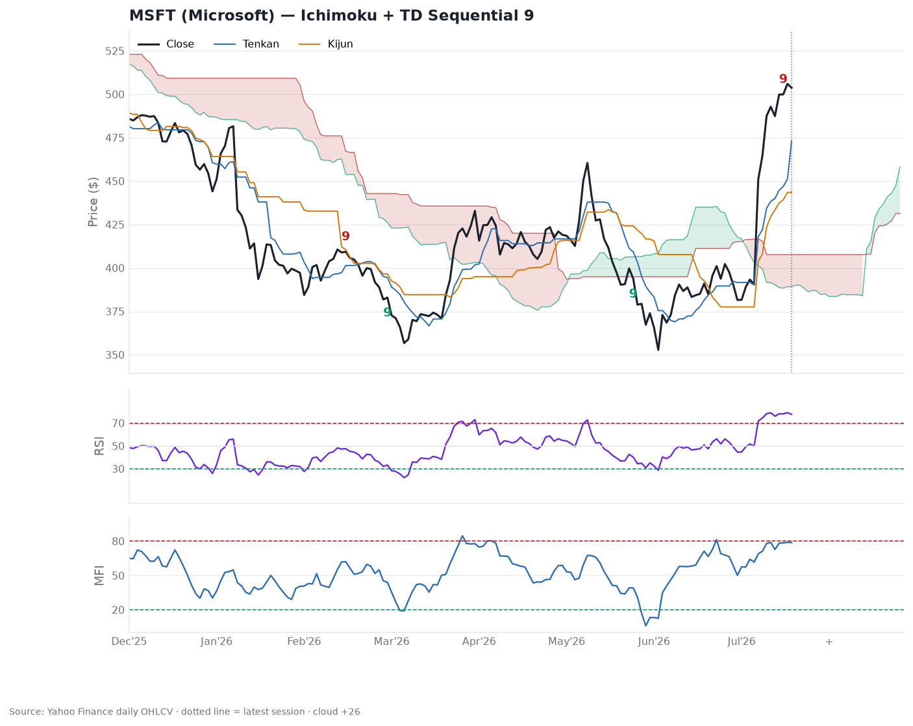

# MSFT — Technical Indicator Read

Four technical indicators computed on real MSFT daily OHLCV (Yahoo Finance, 751 sessions through the latest close of **$503.81**). Context: MSFT fell from ~$490 (Dec 2025) to a ~$353 low in June 2026, then gapped up on late-July earnings and ran near-vertically to ~$504 — read every indicator through that "just broke out and went vertical" lens.

## RSI(14) — momentum: overbought, confirming
- **≈ 77.7**, above 70 in 9 of the last 15 sessions.
- Persistent overbought during a breakout signals trend *strength*, not an automatic sell — but at ~78 there's little slack. Reads as "powerful, but stretched; a poor spot to chase." First cooling tell is RSI losing 70.

## Money Flow Index(14) divergence — volume-weighted momentum
- **MFI ≈ 78.9** (right at the 80 line). **No bearish divergence:** through the last confirmed price swings, MFI made higher highs *and* higher lows with price — real dollar volume backed the move.
- Caveat: the vertical post-earnings run is too recent to have formed a confirmed swing high, so a top divergence can't be measured yet. Watch the **next pullback-and-retest** — a new price high with a lower MFI high would be the distribution warning. Not present today.

## Ichimoku — trend/regime: unambiguously bullish (but extended)
- Price **far above the cloud** ($389-408); **Tenkan $473 > Kijun $443** (bullish TK cross ~Jul 15); **forward cloud green** (Span A $458 > Span B $431); **Chikou above** price 26 sessions ago. All five components bullish.
- The catch is distance: price sits ~24% above the cloud top and ~6% above Tenkan. Logical pullback/support: Tenkan ≈ $473, then Kijun ≈ $443, then cloud ≈ $408.

## DeMark TD Sequential (setup 9) — exhaustion timing: near-term caution
- **Buy-setup 9 completed Jun 16 ($393.83)** — flagged the pre-earnings low; the rally followed.
- **Sell-setup 9 completed Aug 7 ($499.99)**, count now extended to 11.
- A sell-9 near the highs is DeMark's "upside exhausting" flag — argues for a pause/pullback or sideways digestion over ~1-4 weeks rather than immediate continuation. It's a timing/caution signal, not a reversal call; a full countdown (13) would firm it up.

## Composite

The trend/flow indicators (Ichimoku, MFI) say this is a genuine, well-supported breakout in a clearly bullish regime. The momentum/exhaustion indicators (RSI 78, TD sell-9) say it's overbought and short-term overextended. Net: **bullish trend intact, tactically stretched** — the evidence argues against chasing ~$504 and favors digestion back toward Tenkan (~$473) / Kijun (~$443). No high-conviction reversal signal yet (no MFI bearish divergence, cloud still green).

**Caveats:** mechanical, lagging, price-only signals on a single (daily) timeframe; the earnings gap distorts short-lookback indicators for a few weeks; says nothing about valuation or the Azure/capex fundamentals in the [MSFT report](../MSFT-microsoft-analysis.md). Not investment advice.
