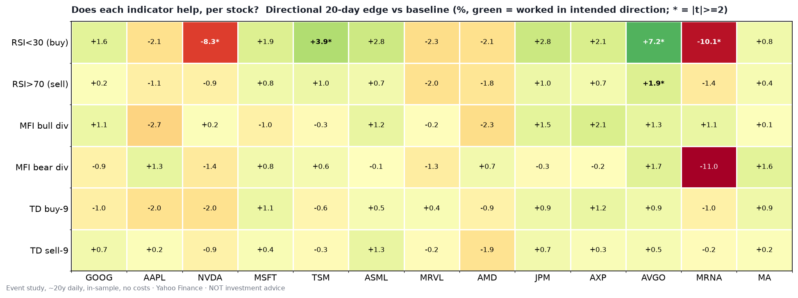
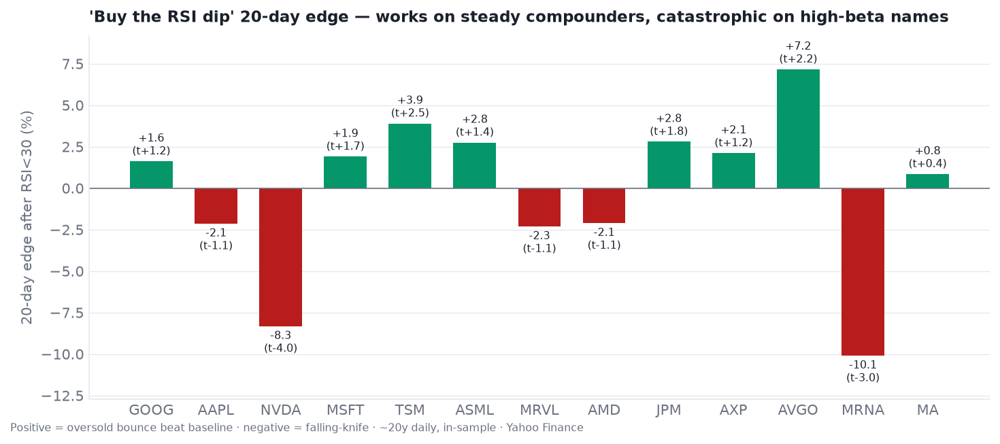
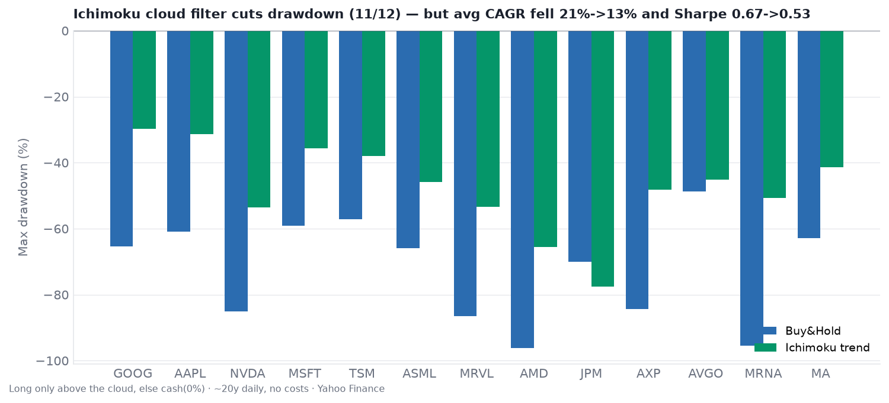

# Technical Indicators — Run + Backtest Across All Tickers

Four indicators — **RSI(14)**, **Money Flow Index(14) divergence**, **Ichimoku**, and **DeMark TD Sequential (9)** — computed for all 13 charted tickers on real daily OHLCV (Yahoo Finance, ~20 years; AVGO from its 2009 IPO, MA from its 2006 IPO, MRNA from its 2018 IPO; RVII excluded, no history), and **backtested** to answer one question: *for which stocks, if any, does each indicator actually have an edge?*

> **Read this first.** In-sample, single-path, no costs/taxes/slippage, raw close (small dividend distortion). 78 event tests were run (6 signals × 13 stocks), so ~4 false positives at |t|≥2 are expected by chance. This is exploratory analysis, **not** a validated system and **not** investment advice.

Code: [`indicator_backtest.py`](indicator_backtest.py), [`make_summary_charts.py`](make_summary_charts.py) · Data: [`data/`](data/) · Per-ticker panels: [`charts/`](charts/) (`{TICKER}-indicators.png`).

## How each indicator was tested

- **Event study** (RSI oversold `<30` / overbought `>70`, MFI bullish/bearish divergence, TD buy-setup-9 / sell-setup-9): measure the **forward 20-day return after each first-trigger event** and compare to the stock's unconditional baseline. `edge = conditional mean − baseline`. Bullish signals should show edge > 0; bearish signals edge < 0. A t-stat flags reliability (|t|≥2 marked `*`). No look-ahead — divergences are dated at swing *confirmation*.
- **Trend system** (Ichimoku): long only while yesterday's close is above the cloud, else cash (0%); compare CAGR / max drawdown / Sharpe vs buy-and-hold.

## The one-look answer

Green = the signal worked in its intended direction; `*` = |t| ≥ 2. The top row (RSI oversold) is the only one carrying real signal — and the key point is that it is **strongly green for the steady names and deep red for the high-beta ones**. Everything below it is mostly noise.

## Current snapshot (latest session)

| Stock | Close | RSI | MFI | vs Cloud | Tenkan/Kijun | TD setup |
|-------|------:|----:|----:|----------|--------------|----------|
| GOOG | $342.88 | 48 | 42 | below | bearish | buy-2 |
| AAPL | $319.70 | 57 | 58 | above | bearish | sell-3 |
| NVDA | $217.55 | 52 | 45 | above | bullish | sell-2 |
| MSFT | $513.53 | 73 | 56 | above | bullish | sell-6 |
| TSM | $417.52 | 50 | 64 | below | bullish | sell-4 |
| ASML | $1696.16 | 43 | 45 | below | bullish | buy-9 |
| MRVL | $216.62 | 47 | 61 | below | bullish | buy-1 |
| AMD | $465.58 | 45 | 52 | below | bearish | sell-4 |
| JPM | $357.62 | 55 | 31 | above | bullish | sell-3 |
| AXP | $333.20 | 43 | 48 | in cloud | bullish | buy-2 |
| AVGO | $368.79 | 43 | 26 | below | bearish | sell-2 |
| MRNA | $137.99 | 64 | 64 | above | bullish | buy-2 |
| **MA** | $595.30 | 67 | 56 | above | bullish | buy-1 |

Most of the set has cooled to mid-range. **MSFT is the warmest** (RSI 73, above cloud) and **MA** is the healthiest fresh entrant (RSI 67, above cloud, bullish TK). Note **MRNA has faded from $174 to $138** since the prior run, with RSI collapsing 92 → 64 — the post-catalyst spike unwound quickly, which is exactly the behaviour its own event study predicts. **ASML has a completed TD buy-9** and sits below its cloud.

## RSI — the only indicator with a real edge, and it is entirely conditional

"Buy the RSI-oversold dip," 20-day forward edge vs baseline:

| Works (steadier names) | Edge | t | Backfires (high-beta) | Edge | t |
|------------------------|-----:|---:|----------------------|-----:|---:|
| AVGO | **+7.1%** | +2.2* | MRNA | **-9.6%** | **-2.8*** |
| TSM | **+3.9%** | +2.5* | NVDA | **-8.3%** | **-4.0*** |
| JPM | +2.8% | +1.8 | MRVL | -2.3% | -1.1 |
| ASML | +2.8% | +1.4 | AAPL | -2.2% | -1.1 |
| AXP | +2.1% | +1.2 | AMD | -2.1% | -1.1 |
| MSFT | +1.9% | +1.7 | | | |
| GOOG | +1.6% | +1.3 | | | |
| MA | +0.9% | +0.4 | | | |

**The split is the finding.** RSI mean-reversion worked on the steadier compounders (8 of 13 positive; TSM and AVGO significant) and was **actively destructive on the high-beta names**: MRNA (-9.6%, t -2.8) and NVDA (-8.3%, t -4.0) are now the two worst, both statistically significant. On those names "oversold" meant *falling knife*, not bounce — MRNA in particular spent years grinding down from its 2021 peak, and every oversold reading on the way down was another leg lower. RSI *overbought* as a sell signal was weak everywhere (only AVGO significant at -1.9%, t -2.4) and backfired on momentum names, which stay overbought while they climb.

**Adding MRNA flipped the pooled result — and that is the honest headline.** With 11 winners the pooled oversold edge was mildly positive (+0.25%); adding one big decliner turned it slightly **negative (-0.10%, now -0.07% with Mastercard included)**. There is no *general* dip-buying edge in this data. The edge exists only conditionally, per stock character, and the two tails nearly cancel in aggregate.

## MFI divergence, TD Sequential 9 — no standalone edge

Pooled across all 13 stocks (20-day forward edge vs baseline):

| Signal | Events | Edge | Hit rate | t | Useful? |
|--------|-------:|-----:|---------:|---:|---------|
| RSI oversold (buy) | 535 | **-0.07%** | 62% | -0.1 | only per-stock (see above) |
| RSI overbought (sell) | 1409 | -0.01% | 59% | -0.0 | no |
| MFI bullish divergence | 489 | +0.18% | 60% | +0.3 | no |
| MFI bearish divergence | 759 | -0.01% | 58% | -0.0 | no |
| TD buy-setup 9 | 641 | -0.16% | 58% | -0.3 | no (wrong sign) |
| TD sell-setup 9 | 1055 | -0.08% | 60% | -0.3 | no |

- **MFI divergence** still shows no reliable pooled edge, and *bearish* divergence has pointed the wrong way on most names — most spectacularly on **MRNA (+11.6%**, n=17, t 1.3): flagging "distribution" right before a doubling. The one genuine exception is the newest name: on **MA, bearish divergence was followed by -1.6% underperformance (n=76, t -1.8)** — the correct sign and the closest any MFI signal comes to significance in this study. One near-miss out of 13 is what chance looks like, so treat it as a lead to test out-of-sample rather than a finding.
- **TD Sequential 9** marks plausible exhaustion points on the charts but produced no 20-day forward edge on any stock (all |t| < 1.5, pooled ≈ 0). Useful as context/confluence at best, not as a standalone timing signal.

## Ichimoku — a drawdown tool, and MRNA is its best case

Long only above the cloud, else cash:

| | Avg CAGR | Avg max drawdown | Avg Sharpe |
|--|--------:|-----------------:|-----------:|
| Buy & Hold | 21.3% | -72.1% | 0.69 |
| Ichimoku trend | 12.7% | -47.4% | 0.54 |

The cloud filter cut max drawdown in **12 of 13** names (avg -72% → -47%) but gave up roughly **40% of the CAGR** (21% → 13%), beating buy-and-hold on Sharpe in only 2 of 13. Those two are the tell:

| Stock | Buy & Hold (CAGR / MaxDD / Sharpe) | Ichimoku | Why it worked |
|-------|-----------------------------------|----------|---------------|
| **MRNA** | 29.7% / -95.4% / 0.64 | **34.7% / -50.6% / 0.82** | Parabolic COVID run then a 95% collapse — the filter sat out most of the collapse |
| **AMD** | 13.8% / -96.2% / 0.51 | 17.4% / -65.6% / 0.60 | Deepest crasher in the set |
| MA (counter-example) | 27.2% / -62.8% / 0.91 | 15.0% / -41.4% / 0.73 | Steady compounder — the filter cut drawdown but cost 12 points of CAGR |

That pattern is consistent and economically sensible: **trend filters pay only when the crash you avoid is catastrophic.** MRNA (-95%) and AMD (-96%) are the two worst buy-and-hold drawdowns, and they are the only two wins. **Mastercard is the clean counter-example**: a high-Sharpe compounder where the filter halved drawdown but cost 12 points of CAGR and 0.18 of Sharpe. **JPM** remains the whipsaw casualty (drawdown got *worse*, -70% → -78%). Same lesson as the SMA-200 test in [`../backtests/`](../backtests/) — where MRNA is an even more dramatic case (CAGR 33.9% → 66.4%): trend filters buy insurance, not alpha, and the insurance is only worth the premium on collapse-prone names.

## Verdict — for which stocks are these useful?

| Indicator | Useful on… | Not useful / harmful on… |
|-----------|-----------|--------------------------|
| **RSI oversold (dip-buy)** | Steadier compounders: **TSM, AVGO** (significant), JPM, MSFT, ASML, AXP, GOOG, MA | High-beta / collapse-prone: **MRNA, NVDA** (both significantly harmful), AMD, MRVL, AAPL |
| **RSI overbought (sell)** | Marginally AVGO only | Everyone else; backfires on momentum names |
| **MFI divergence** | None reliably (MA's bearish divergence is the lone near-miss, t -1.8) | All others (bearish divergence often points the wrong way — see MRNA) |
| **TD Sequential 9** | None reliably (standalone) | All 13 |
| **Ichimoku trend** | Drawdown insurance everywhere; risk-adjusted win only on **MRNA, AMD** (the deepest crashers) | Costs meaningful return on the other 11; whipsaws JPM |

**Bottom line:** across these 13 names there is **no general-purpose technical edge**. The one real signal — RSI-oversold dip-buying — is entirely conditional on the stock's character: reliably positive on lower-beta compounders, and significantly *destructive* on parabolic/collapse-prone names where trend-continuation dominates mean-reversion. The pooled edge is ~zero precisely because those two groups cancel. MFI divergence and TD Sequential 9 show no standalone forward-return edge on any of these stocks. Ichimoku is a drawdown reducer whose cost is only justified where drawdowns are catastrophic (MRNA, AMD). **Match the tool to the stock, or don't use the tool.**

## Caveats

In-sample, single historical path, 13 hand-picked large caps (12 big winners plus MRNA as the one decliner — better than an all-winners sample, but still not representative), no costs/taxes/slippage, raw close, single (daily) timeframe, and 78 event tests (multiple-comparisons risk). MRNA's own sample is small (18 oversold events, 17 bearish divergences), so its extremes are suggestive rather than settled. Indicators are mechanical and lagging and say nothing about fundamentals. **Not investment advice.**
